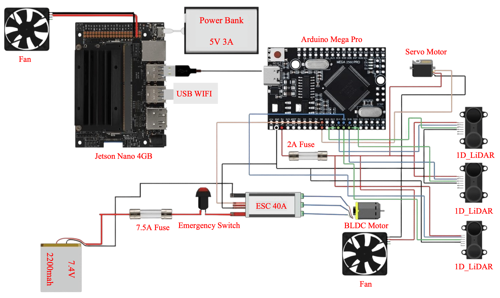

# Autonomous-Formula-Challenge

## Overview
This project showcases a small-scale autonomous formula car developed for the Open Robotics International Competition (ORIC) and the Global Robotics Challenge (GRC). The system is designed to navigate racing tracks fully autonomously by adjusting its steering and velocity based on real-time sensor input.

At the core of the speed control system is a fuzzy logic–based decision model that continuously interprets 1D LiDAR data to adapt the vehicle's velocity based on track conditions. Steering is handled through a custom rule-based algorithm that calculates direction by analyzing lateral distance differences.

### Key objectives:
- Achieving smooth and reactive navigation on curved tracks
- Maintaining optimal speed through adaptive control
- Demonstrating robust performance in a competitive autonomous racing scenario

## System Prototype

  <table>
    <tr>
      <td align="center">
        
      </td>
      <td align="center">
        
      </td>
    </tr>
  </table>

Small-scale autonomous formula car prototype featuring a mounted 1D LiDAR sensors, onboard computer for real-time processing, wireless communication module, and a top-mounted emergency stop system. Designed with a compact and functional control layout optimized for autonomous track navigation.

## System Architecture

### Hardware Components

  
   
  <em>Complete system wiring diagram showing interconnections between all hardware components</em>

The autonomous formula car integrates multiple hardware components working in coordination:

**Core Processing:**
- **Jetson Nano 4GB**: Main computational unit handling AI inference and control algorithms
- **Arduino Mega Pro**: Real-time sensor data processing and motor control interface

**Sensors & Navigation:**
- **1D LiDAR Sensors (3x)**: Provide distance measurements for obstacle detection and path planning

**Power & Safety Systems:**
- **Power Bank (5V 3A)**: Primary power supply for electronics
- **7.4V Battery**: Dedicated power for motor systems
- **Emergency Switch**: Manual safety override system
- **Fuses (2A, 7.5A)**: Circuit protection for different power domains

**Actuation & Control:**
- **Servo Motor**: Precision steering control
- **Brushless Motor with ESC (40A)**: High-efficiency propulsion system
- **Cooling Fans (2x)**: Thermal management for electronics

**Connectivity:**
- **USB WiFi**: Wireless communication for telemetry and remote monitoring

## Track Environment

  
   
  <em>Testing track used for performance evaluation, designed to challenge autonomous navigation through varying curves and straight-line segments</em>

